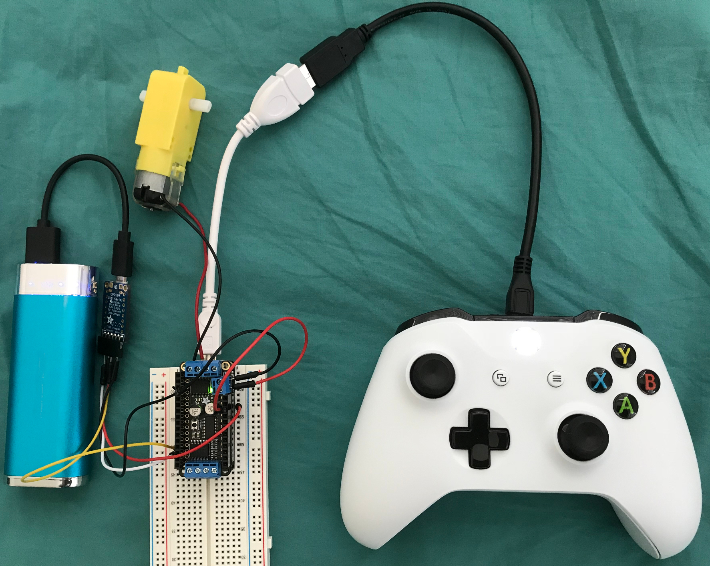

# Control DC Motor with an Xbox One controller

Demonstrate using an Xbox One to control motor speed. This projects uses the
USB host capability of the SAMD21. The
[USB Host Library for SAMD](https://github.com/gdsports/USB_Host_Library_SAMD)
is required to make this work.

The Boring Company (Elon Musk's tunnel digging company) uses an
[Xbox controller](https://www.engadget.com/2018/09/10/boring-company-steers-machine-with-xbox-controller/).

## Dependencies

* [USB Host Library for SAMD](https://github.com/gdsports/USB_Host_Library_SAMD)
* Adafruit Motor Shield V2 Library by Adafruit

## Components

* 1 x Adafruit Feather M0 Express
* 1 x Adafruit FeatherWing Motor Controller
* 1 x Microsoft Xbox One Controller
* 1 x USB OTG to host cable or adapter
* 1 x USB micro cable
* 1 x 5V, 2A power pack
* 1 x CP2104 USB serial

